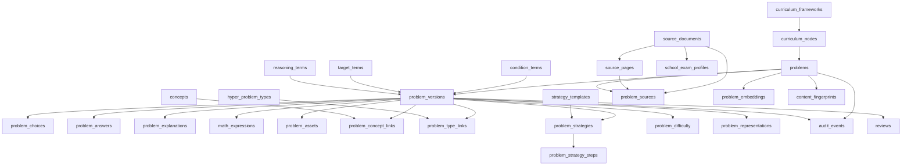

# HYPER QUESTION BANK — Question DB MASTER SCHEMA v1

DESIGN DRAFT — NOT DATABASE CONTRACT  
STEP 2 · 설계만. 실제 table / migration / pgvector / embedding 생성 없음.

쌍둥이 문제의 정의: 문장·숫자·고유명사가 달라도 **핵심 개념, 해결 전략, 조건 구조, 수식 구조, 사고 단계, 요구하는 결과**가 유사한 문제.  
단순 text embedding만으로 찾지 않는다. 구조화 feature + semantic similarity를 함께 쓸 수 있어야 한다.

---

## A. 전체 ERD 개념도



핵심: `problems`는 정체성·수명주기, `problem_versions`는 내용 스냅샷, taxonomy는 별도 테이블, embedding은 분리.

---

## B. entity 목록

| 그룹 | entity |
|---|---|
| 원본 | `source_documents`, `source_pages`, `school_exam_profiles`, `problem_sources` |
| 문제 핵 | `problems`, `problem_versions`, `problem_choices`, `problem_answers`, `problem_explanations`, `problem_assets` |
| 수학 구조 | `math_expressions`, `problem_conditions`, `problem_targets` |
| 교육과정 | `curriculum_frameworks`, `curriculum_nodes`, `problem_curriculum` |
| 분류 | `concepts`, `problem_concept_links`, `hyper_problem_types`, `problem_type_links` |
| 전략/사고 | `strategy_templates`, `strategy_template_steps`, `problem_strategies`, `problem_strategy_steps`, `reasoning_terms`, `problem_reasoning` |
| 난이도/표현 | `problem_difficulty`, `problem_representations`, `variation_slots` |
| 검색 | `content_fingerprints`, `problem_embeddings`, `duplicate_links` |
| 검수 | `reviews`, `audit_events` |
| 용어집 | `condition_terms`, `target_terms` |

---

## C. 각 entity 목적

- **source_documents**: 파일·교재·시험지 원본. 문제와 분리.
- **source_pages**: 페이지 이미지와 추출 상태. 원본 위치 추적.
- **school_exam_profiles**: 학교시험 전용 확장. 일반 교재에 학교 컬럼을 수십 개 붙이지 않음.
- **problems**: 안정적 문제 ID와 공개 코드, 현재 버전 포인터, 사용/보관 상태.
- **problem_versions**: OCR → 자동정제 → 강사수정 스냅샷. 원본을 덮어쓰지 않음.
- **problem_choices**: 선택지 행. JSON 문자열 하나에 가두지 않음.
- **math_expressions**: 원문과 분리된 수식 feature.
- **curriculum_***: 가변 깊이 트리. 학기/단원 깊이가 달라도 수용.
- **concepts / hyper_problem_types**: 표준 분류. 교재 유형명과 분리.
- **strategy_***: 표준화된 풀이 단계. 문장 비교가 아님.
- **problem_difficulty**: 6차원 + overall + 출처.
- **problem_embeddings**: 모델 교체 가능한 벡터 저장소.
- **content_fingerprints**: exact/near/underlying 중복 탐지용 해시.
- **reviews / audit_events**: 검수와 필드 단위 변경 추적.

---

## D. 주요 field

### source_documents
`id`, `title`, `publisher`, `author`, `year`, `edition`, `document_type`, `source_type`, `original_filename`, `file_hash`, `page_count`, `license_status`, `usage_scope`, `copyright_note`, `created_at`, `archived_at`

### source_pages
`id`, `source_document_id`, `page_number`, `page_image_path`, `extraction_status`, `review_status`

### problems
`id` (UUID), `public_code` (HQB-000001), `current_version_id`, `lifecycle_status`, `use_status`, `created_at`, `updated_at`, `archived_at`

### problem_versions
`id`, `problem_id`, `version_no`, `origin` (OCR/AUTO_CLEAN/TEACHER_EDIT/IMPORT), `problem_text`, `normalized_text`, `instruction`, `item_format`, `choice_count`, 상태 필드, `created_at`

### problem_choices
`version_id`, `sort_order`, `label`, `choice_text`, `latex`, `asset_id`, `normalized_text`

### math_expressions
`version_id`, `original_expression`, `normalized_expression`, `latex`, `role`, `structure_tags[]` (FK to lookup 권장), `skeleton`

skeleton 예: `x^2+px+q=0` — 변수명·계수를 제거한 구조 키.

### problem_difficulty
`version_id`, `source` (HUMAN_ASSIGNED / MODEL_ESTIMATED / CALIBRATED),  
`concept_difficulty`, `calculation_complexity`, `reasoning_depth`, `condition_complexity`, `representation_complexity`, `trap_level` (각 1–5), `overall_difficulty`

### problem_embeddings
`id`, `problem_id`, `embedding_type`, `model`, `model_version`, `vector`, `created_at`

---

## E. PK/FK 관계

| child | FK | parent | ON DELETE 초안 |
|---|---|---|---|
| source_pages | source_document_id | source_documents | RESTRICT (문제 연결 시) |
| school_exam_profiles | source_document_id | source_documents | CASCADE (확장 1:1) |
| problem_sources | problem_id / document / page | problems, documents, pages | 문서 삭제 시 SET NULL 또는 RESTRICT |
| problem_versions | problem_id | problems | RESTRICT |
| problem_choices 등 | version_id | problem_versions | CASCADE (버전 스냅샷 내부) |
| problem_concept_links | version_id, concept_id | versions, concepts | CASCADE / RESTRICT |
| problem_embeddings | problem_id | problems | CASCADE (벡터만) |

`problems`는 source CASCADE로 지우지 않는다.

---

## F. cardinality

- document 1 — N pages
- document 0..1 school_exam_profile
- problem N — M documents (`problem_sources`, 주 출처 `is_primary`)
- problem 1 — N versions
- version 1 — N choices / expressions / assets
- version N — M concepts, types, representations, conditions, targets, reasoning
- version 1 — N strategies (주 전략 `is_primary`)
- strategy 1 — N ordered steps
- problem 1 — N embeddings (모델/타입별)

---

## G. enum / taxonomy 후보

**닫힌 상태값 (lookup table 권장, DB ENUM은 변경 비용 큼):**  
`document_type`, `license_status`, `item_format`, `expression_role`, `review_status`, `answer_type`, `difficulty_source`, `version_origin`, `lifecycle_status`, `use_status`, `duplicate_class`

**열린 taxonomy (코드+이름+부모, 교재마다 늘어남):**  
`curriculum_nodes`, `concepts`, `hyper_problem_types`, `condition_terms`, `target_terms`, `reasoning_terms`, `strategy_templates`

교재 유형명 `source_type_label` ≠ HYPER 표준 `hyper_problem_type`.

조건/목표 예 (초기 시드, 확정 아님):

- conditions: `NATURAL_NUMBER`, `DISTINCT`, `REAL_NUMBER`, `SUM_FIXED`, `RANGE_RESTRICTION`, `GEOMETRIC_CONSTRAINT`
- targets: `VALUE`, `EQUATION_ROOT`, `SUM_OF_ROOTS`, `PRODUCT_OF_ROOTS`, `MAXIMUM`, `MINIMUM`, `LENGTH`, `AREA`, `PROBABILITY`, `PROOF`

---

## H. JSONB 사용 후보와 이유

| 사용 | 이유 |
|---|---|
| `bounding_box` | 좌표 스키마가 OCR 엔진마다 다를 수 있음 |
| `audit_events.payload` | old/new 필드 형태가 엔티티마다 다름 |
| `school_exam_profiles.extra` | 학교별 비표준 메타 |
| `variation_slots.parameters` | 향후 생성용, 아직 스키마 고정 금지 |

**JSONB로 두지 않음:** 선택지, 개념, 유형, 전략 step, 난이도 차원, taxonomy 이름. 검색·집계 대상이기 때문.

---

## I. index 후보

- `problems.public_code` UNIQUE
- `problem_versions (problem_id, version_no)` UNIQUE
- `source_pages (source_document_id, page_number)` UNIQUE
- `problem_sources (problem_id)` / `(source_document_id)`
- `math_expressions.skeleton`
- `content_fingerprints.normalized_text_hash`, `structure_hash`
- `problem_concept_links (concept_id)`, `problem_type_links (hyper_type_id)`
- `problems (lifecycle_status, use_status)` 부분 인덱스
- embedding: 향후 vector index (pgvector 여부는 미정)
- GIN: `structure_tags`가 array/JSONB일 때

수만~수십만 행을 가정. 거대한 단일 JSON problem blob은 만들지 않음.

---

## J. 삭제 정책

원본 삭제 시 검수된 문제를 CASCADE로 지우지 않는다.

1. **source_document**: soft delete (`archived_at`). 물리 삭제는 연결된 ACTIVE 문제가 없을 때만.
2. **problem**: soft delete. 문제지 사용 이력이 있으면 archive.
3. **source detach**: `problem_sources` 행만 제거/NULL. 문제 본체 유지.
4. **version**: 삭제 금지. 새 버전을 추가.
5. **embedding / fingerprint**: 문제 archive 시 함께 숨기거나 삭제 가능 (파생 데이터).

원칙: 원본 파일은 없앨 수 있어도, 검수된 구조화 문제는 남긴다.

---

## K. version / audit 정책

- 모든 본문·수식·정답·분류 변경은 새 `problem_versions` 또는 링크 테이블 변경 + `audit_events`.
- `origin`: OCR → AUTO_CLEAN → TEACHER_EDIT 추적.
- `current_version_id`만 포인터. 과거 버전 유지.
- `audit_events`: `actor_id`, `at`, `entity`, `field`, `from`, `to`. QUESTION BANK 내부 계정. Student Care 사용자 PK에 종속하지 않음.

---

## L. human review 구조

`reviews`: `version_id`, `status` (UNREVIEWED / AUTO_CLASSIFIED / NEEDS_REVIEW / VERIFIED / REJECTED), `reviewer_id`, `note`, `reviewed_at`

강사 수정 가능: 본문, 수식, 선택지, 정답, 해설, 단원, 개념, 유형, 전략, 난이도.  
수정은 새 버전 또는 링크 재작성이며 audit에 남김. 자동 분류만으로 `use_status=WORKSHEET_ELIGIBLE`이 되면 안 됨.

---

## M. similarity feature 구조

컴포넌트는 독립 계산:

| component | 입력 |
|---|---|
| curriculum | 공유 노드 깊이 |
| concept | primary/weighted 개념 집합 |
| problem type | hyper type path |
| solution strategy | template id + step sequence |
| expression structure | skeleton + structure tags |
| condition / target | term sets |
| reasoning | trait sets |
| difficulty | 차원 벡터 거리 |
| representation | 종류 집합 |
| semantic | embedding cosine (보조) |

**원칙:** solution strategy와 mathematical structure가 단순 semantic보다 중요하다.  
예시 가중치(concept 20, type 15, strategy 25, expression 15, condition 8, target 7, difficulty 5, semantic 5)는 **확정하지 않음**.

최종 twin score는 가중합 또는 이후 ranking 모델. STEP 2에서 가중치 freeze 금지.

---

## N. embedding 분리 구조

`problem_embeddings`는 필수 컬럼이 아니다. 모델/버전별로 여러 행. 교체 시 새 행 추가, `problems` 불변.  
STEP 2에서 pgvector 활성화·벡터 생성 없음.

---

## O. 저작권 / 라이선스 구조

문서 단위 `license_status` + `usage_scope`가 기본. 문제 단위 override 컬럼을 `problems`에 둘 수 있음 (문서보다 엄격한 쪽으로만).

정책 레이어(미구현): `UNKNOWN` / `RESTRICTED`는 외부 배포 문제지 후보에서 제외. 내부 검수·검색은 가능.

---

## P. 학교시험 확장 구조

`document_type=SCHOOL_EXAM`일 때만 `school_exam_profiles` 1:1.  
필드: 학교, 시험년도, 학년, 학기, 중간/기말, 과목, `extra` JSONB.  
문제 본체(`problems`)는 교재 문제와 동일.

---

## Q. Student Care 향후 연동 원칙

QUESTION BANK는 독립 시스템. `students` FK 없음.  
향후: 외부 `student_ref` / API mapping / integration layer로  
student answer → wrong problem id → error class → twin 추천.  
HYPER STUDENT CARE DB에 테이블을 만들지 않음.

---

## 교육과정 트리 (과도한 rigid 방지)

```
curriculum_frameworks (예: 2022 개정)
  └ curriculum_nodes.parent_id
       SCHOOL_LEVEL / GRADE / SEMESTER? / SUBJECT / UNIT(임의 깊이)
```

학기·중단원·소단원은 없어도 된다. 고등학교 과목(공통수학, 대수 등)은 같은 노드 종류로 확장.  
개념(`concepts`)은 트리 잎이 아니라 독립 catalog. 여러 단원에 연결 가능.

---

## ID 정책

| | 내부 PK | 공개 코드 |
|---|---|---|
| 값 | UUID | `HQB-000001` 순번 |
| 의미 | 없음 | 의미 없음 |

`HQB-M3-000001`처럼 학년을 코드에 넣지 않는다. 분류가 바뀌면 코드가 거짓이 된다. 학년은 curriculum 링크로만 표현.

---

## 선택지: 별도 테이블

4지·5지 모두 `choice_count` + rows. 선택지별 텍스트/수식/이미지/정규화. JSON 한 덩어리는 검색·검수에 불리하므로 기본 거절.

---

## 난이도 1–5 장단점

장점: 사람 입력 부담이 적고, 차원 간 비교가 쉽다.  
단점: 척도가 거칠고, 채점자 간 보정이 필요.  
overall는 산술평균이 아니라 별도 필드(초기 human, 이후 calibrated). 학생 정답률은 Student Care 연동 후 `CALIBRATED` 행으로 추가.

---

## 표현 형식

단일 enum 대신 `problem_representations` M:N. MIXED는 파생값으로도 계산 가능. 그래프+식 동시 존재 허용.

---

## 문제 변형 슬롯 (미구현)

`variation_slots`: coefficients, constants, variable names, ranges 등. 자동 생성 기능은 STEP 2 범위 밖.

---

## 중복 탐지

file hash만으로 문제 중복을 판단하지 않음.

- exact: normalized_text_hash
- near: text distance + skeleton
- same underlying: skeleton + strategy + target
- independently similar: twin score (별 클래스)

`duplicate_links(problem_a, problem_b, class, score)`

---

## 정답 / 해설

`answer_type` 분리. 객관식 번호·숫자·식·복수·서술·구간·집합.  
해설 3종: ORIGINAL / NORMALIZED / TEACHER. 강사 해설을 OCR 해설과 덮어쓰지 않음.

---

## Pseudo SQL (실행하지 말 것)

```sql
-- DRAFT ONLY. Do not run in STEP 2.
CREATE TABLE problems (
  id uuid PRIMARY KEY,
  public_code text UNIQUE NOT NULL,
  current_version_id uuid,
  lifecycle_status text NOT NULL,
  use_status text NOT NULL,
  archived_at timestamptz
);
```

실제 migration 파일은 만들지 않는다.

---

## 샘플 3문제 검증

자체 제작. 상용 교재 비복사.

| 샘플 | 표현 여부 |
|---|---|
| A 3x+7=22 | 일차방정식, 직접 풀이, skeleton `ax+b=c`, 난이도 1차원들 |
| B x²-5x+6=0 | 복수 개념, 인수분해 유형, 5 step 전략, quadratic skeleton, target=근 |
| C 자연수 합 10 곱 최대 | 조건 NATURAL/DISTINCT/SUM_FIXED, target=MAXIMUM, modeling |

상세 object: `src/types/question-schema-draft.ts`

---

## Twin 비교

**Twin 후보:** `x²-5x+6=0` vs `y²-7y+12=0`  
같음: 개념(인수분해 이차), hyper type, 전략 5 step, skeleton `x^2+px+q=0`, target `EQUATION_ROOT`, 두 정수근.  
다름: 변수명, 계수, 표면 문장. semantic만 보면 다를 수 있으나 구조 feature로 twin.

**반례:** `y=-x²+4x+5` 최댓값  
느슨한 라벨만 “이차”로 공유. type=이차함수 최댓값, strategy=완전제곱, target=MAXIMUM, skeleton=`y=ax^2+bx+c`.  
이차방정식이라는 이유만으로 twin이면 안 된다.

---

## 설계 자체 검증 (14)

| # | 질문 | 결과 |
|---|---|---|
| 1 | 문제집이 달라도 HYPER 유형으로 묶는가 | PASS. `hyper_problem_types` vs `source_type_label` |
| 2 | 같은 단원, 다른 전략 구별 | PASS. strategy template id + steps |
| 3 | 숫자만 다른 쌍둥이 | PASS. skeleton + strategy. Twin B/B2 |
| 4 | 문장 비슷, 풀이 다름 걸러냄 | PASS. 반례 이차함수 최댓값 |
| 5 | 한 문제 여러 개념 | PASS. M:N + primary/weight |
| 6 | 난이도 다차원 | PASS. 6축 + overall + source |
| 7 | OCR vs 강사 수정 | PASS. versions.origin + audit |
| 8 | 원본 페이지 추적 | PASS. problem_sources + pages |
| 9 | 저작권 추적 | PASS. license_status, usage_scope |
| 10 | embedding 모델 교체 | PASS. 분리 테이블 |
| 11 | 중등→고등 | PASS. 가변 curriculum tree |
| 12 | 학교시험 동일 core | PASS. school_exam_profiles 확장 |
| 13 | 수십만 검색 | 주의. 관계형+지정 인덱스. vector 엔진 미정 |
| 14 | Student Care 독립 | PASS. 학생 FK 없음 |

---

## STEP 3 전에 결정할 것

문서 하단 보고용 목록과 동일. 이 초안은 계약이 아니다.
