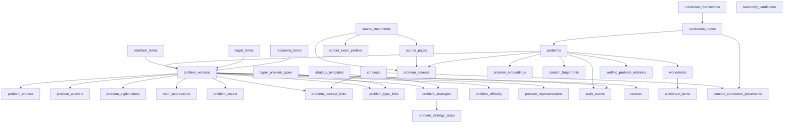

# HYPER QUESTION BANK — Question DB MASTER SCHEMA v1

STATUS: DESIGN FREEZE — v1  
DATABASE IMPLEMENTATION: NOT YET CREATED

DESIGN DRAFT — NOT DATABASE CONTRACT. 실제 table / migration / pgvector / embedding 생성 없음.

쌍둥이 문제: 문장·숫자·고유명사가 달라도 **핵심 개념, 해결 전략, 조건 구조, 수식 구조, 사고 단계, 요구하는 결과**가 유사한 문제.  
단순 text embedding만으로 T1/T2를 결정하지 않는다.

검증 문서: [QUESTION_DB_DESIGN_VALIDATION_v1.md](./QUESTION_DB_DESIGN_VALIDATION_v1.md)

---

## Decision Log (STEP 2.5)

1. **Taxonomy** — catalog/lookup tables. Postgres ENUM은 닫힌 시스템 상태에만. Taxonomy를 ENUM으로 만들지 않음. STEP 3에서 ENUM vs CHECK 최종 선택.
2. **public_code** — `HQB-000001` sequential. 학년/단원/난이도 의미 금지. PK는 UUID. UNIQUE. 자릿수 확장 가능.
3. **Difficulty** — 6차원 각 1–5. 상/중/하 단일값 금지.
4. **overall_difficulty** — v1 초기값은 6차원 산술평균. 영구 공식 아님. HUMAN/MODEL/CALIBRATED를 덮어쓰지 않음.
5. **Version** — VERIFIED 이후 수정은 새 version 필수. 그 이전 자동처리 transient는 in-place 허용. raw snapshot 보존.
6. **Source** — problem↔source는 처음부터 N:M (`problem_sources`).
7. **Bounding box** — JSONB canonical `{x,y,width,height,unit,pageWidth,pageHeight}`. `normalized` 지원. 검색 taxonomy 아님.
8. **Condition/target** — HYPER controlled vocabulary. AUTO_DISCOVERED ≠ APPROVED.
9. **Vector** — pgvector 미확정. `problem_embeddings`만 유지. embedding은 보조 feature.
10. **Worksheet usage** — `worksheets` + `worksheet_items`(problem_id + problem_version_id). 기능 미구현, schema만.
11. **Twin level** — T1/T2/T3/RELATED/NOT_RELATED는 pair 관계. `problems.twin_level` 컬럼 없음.
12. **Similarity scale** — 내부 0–1 권고. UI는 0–100 표시 가능.
13. **Hard gate** — semantic이 구조 불일치를 상쇄해 T1이 되지 못하게 함. threshold 숫자는 미확정.
14. **Pair storage** — 전 pair 영구 저장 금지. verified pair만 저장. canonical `(min_id, max_id)`.
15. **Algorithm version** — `HQB-TWIN-v1` 등. 검수 결과에 스냅샷.

---

## A. 전체 ERD 개념도



핵심: `problems`는 정체성·수명주기, `problem_versions`는 내용 스냅샷, taxonomy는 lookup, embedding 분리, twin은 pair 관계, 문제지는 version을 보존.

---

## B. entity 목록

| 그룹 | entity |
|---|---|
| 원본 | `source_documents`, `source_pages`, `school_exam_profiles`, `problem_sources` |
| 문제 핵 | `problems`, `problem_versions`, `problem_choices`, `problem_answers`, `problem_explanations`, `problem_assets` |
| 수학 구조 | `math_expressions`, `problem_conditions`, `problem_targets` |
| 교육과정 | `curriculum_frameworks`, `curriculum_nodes`, `problem_curriculum`, `concept_curriculum_placements` |
| 분류 | `concepts`, `problem_concept_links`, `hyper_problem_types`, `problem_type_links`, `taxonomy_candidates` |
| 전략/사고 | `strategy_templates`, `strategy_template_steps`, `problem_strategies`, `problem_strategy_steps`, `reasoning_terms`, `problem_reasoning` |
| 난이도/표현 | `problem_difficulty`, `problem_representations`, `variation_slots` |
| 검색 | `content_fingerprints`, `problem_embeddings`, `duplicate_links`, `verified_problem_relations` |
| 검수 | `reviews`, `audit_events` |
| 용어집 | `condition_terms`, `target_terms` |
| 문제지 | `worksheets`, `worksheet_items` |

---

## C. 각 entity 목적

- **source_documents**: 파일·교재·시험지 원본. 문제와 분리.
- **source_pages**: 페이지 이미지와 추출 상태. 원본 위치 추적.
- **school_exam_profiles**: 학교시험 전용 확장. 일반 교재에 학교 컬럼을 수십 개 붙이지 않음.
- **problems**: 안정적 문제 ID와 공개 코드, 현재 버전 포인터, 사용/보관 상태.
- **problem_versions**: OCR → 자동정제 → 강사수정 스냅샷. 원본을 덮어쓰지 않음.
- **problem_choices**: 선택지 행. JSON 문자열 하나에 가두지 않음.
- **math_expressions**: 원문과 분리된 수식 feature.
- **curriculum_***: 가변 깊이 트리. 학기/단원 깊이가 달라도 수용.
- **concepts**: 수학 개념 catalog. 교육과정 배치와 분리 (`concept_curriculum_placements`).
- **taxonomy_candidates**: AUTO_DISCOVERED 용어. 승인 전 production taxonomy가 아님.
- **verified_problem_relations**: 강사가 확정한 T1–RELATED pair만 영구 저장.
- **worksheets / worksheet_items**: 문제지 사용 이력. `problem_version_id` 필수.
- **strategy_***: 표준화된 풀이 단계. 문장 비교가 아님.
- **problem_difficulty**: 6차원 + overall + 출처.
- **problem_embeddings**: 모델 교체 가능한 벡터 저장소.
- **content_fingerprints**: exact/near/underlying 중복 탐지용 해시.
- **reviews / audit_events**: 검수와 필드 단위 변경 추적.

---

## D. 주요 field

### source_documents
`id`, `title`, `publisher`, `author`, `year`, `edition`, `document_type`, `source_type`, `original_filename`, `file_hash`, `page_count`, `license_status`, `usage_scope`, `copyright_note`, `created_at`, `archived_at`

### source_pages
`id`, `source_document_id`, `page_number`, `page_image_path`, `extraction_status`, `review_status`

### problems
`id` (UUID), `public_code` (HQB-000001), `current_version_id`, `lifecycle_status`, `use_status`, `created_at`, `updated_at`, `archived_at`

### problem_versions
`id`, `problem_id`, `version_no`, `origin` (OCR/AUTO_CLEAN/TEACHER_EDIT/IMPORT), `problem_text`, `normalized_text`, `instruction`, `item_format`, `choice_count`, 상태 필드, `created_at`

### problem_choices
`version_id`, `sort_order`, `label`, `choice_text`, `latex`, `asset_id`, `normalized_text`

### math_expressions
`version_id`, `original_expression`, `normalized_expression`, `latex`, `role`, `structure_tags[]` (FK to lookup 권장), `skeleton`

skeleton 예: `x^2+px+q=0` — 변수명·계수를 제거한 구조 키.

### problem_difficulty
`version_id`, `source` (HUMAN / MODEL / CALIBRATED), 6 dimension 1–5, `overall_difficulty` (numeric, v1 = 평균)

### problem_sources
`problem_id`, `source_document_id`, `source_page_id`, `original_problem_number`, `bounding_box` JSONB, `source_type_label`, `is_primary_source`

### bounding_box (JSONB, 검색 아님)
`{ x, y, width, height, unit: "normalized"|"pixel"|"point", pageWidth, pageHeight }`  
normalized는 0–1. 해상도가 달라도 영역 재현.

### worksheets / worksheet_items
worksheet: `id`, `title`, `purpose`, `created_at`  
item: `worksheet_id`, `problem_id`, `problem_version_id`, `order_no`

### verified_problem_relations
canonical `(problem_a_id, problem_b_id)`, `relation_level`, `verified_by`, `verified_at`, `component_scores`, `algorithm_version`

### problem_embeddings
`id`, `problem_id`, `embedding_type`, `model`, `model_version`, `vector`, `created_at`

---

## E. PK/FK 관계

| child | FK | parent | ON DELETE 초안 |
|---|---|---|---|
| source_pages | source_document_id | source_documents | RESTRICT (문제 연결 시) |
| school_exam_profiles | source_document_id | source_documents | CASCADE (확장 1:1) |
| problem_sources | problem_id / document / page | problems, documents, pages | 문서 삭제 시 SET NULL 또는 RESTRICT |
| problem_versions | problem_id | problems | RESTRICT |
| problem_choices 등 | version_id | problem_versions | CASCADE (버전 스냅샷 내부) |
| problem_concept_links | version_id, concept_id | versions, concepts | CASCADE / RESTRICT |
| problem_embeddings | problem_id | problems | CASCADE (벡터만) |

`problems`는 source CASCADE로 지우지 않는다.

---

## F. cardinality

- document 1 — N pages
- document 0..1 school_exam_profile
- problem N — M documents (`problem_sources`, 주 출처 `is_primary`)
- problem 1 — N versions
- version 1 — N choices / expressions / assets
- version N — M concepts, types, representations, conditions, targets, reasoning
- version 1 — N strategies (주 전략 `is_primary`)
- strategy 1 — N ordered steps
- problem 1 — N embeddings (모델/타입별)

---

## G. enum / taxonomy 후보

**닫힌 시스템 상태 (STEP 3에서 Postgres ENUM 또는 CHECK):**  
`review_status`, `version_origin`, `difficulty_source`, `lifecycle_status`, `use_status`, `twin_relation_level`(relation 테이블만)

**LOOKUP / catalog (ENUM 금지):**  
`curriculum_nodes`, `concepts`, `hyper_problem_types`, `condition_terms`, `target_terms`, `reasoning_terms`, `strategy_templates`

교재 유형명 `source_type_label` ≠ HYPER 표준 `hyper_problem_type`.

조건/목표 시드 예 (승인 전 candidate와 분리):

- conditions: `NATURAL_NUMBER`, `DISTINCT`, `REAL_NUMBER`, `SUM_FIXED`, `RANGE_RESTRICTION`, `GEOMETRIC_CONSTRAINT`
- targets: `VALUE`, `EQUATION_ROOT`, `SUM_OF_ROOTS`, `PRODUCT_OF_ROOTS`, `MAXIMUM`, `MINIMUM`, `LENGTH`, `AREA`, `PROBABILITY`, `PROOF`

용어 워크플로: 분석 → 기존 매칭 → 없음 → `taxonomy_candidates` → 강사 승인 → lookup 추가.  
AUTO_DISCOVERED ≠ APPROVED TAXONOMY.

---

## H. JSONB 사용 후보와 이유

| 사용 | 이유 |
|---|---|
| `bounding_box` | 위치 복원 metadata. canonical JSONB. GIN으로 검색하지 않음 |
| `verified_problem_relations.component_scores` | 당시 알고리즘 스냅샷 |
| `audit_events.payload` | old/new 필드 형태가 엔티티마다 다름 |
| `school_exam_profiles.extra` | 학교별 비표준 메타 |
| `variation_slots.parameters` | 향후 생성용 |

**JSONB로 두지 않음:** 선택지, 개념, 유형, 전략 step, 난이도 차원, taxonomy 이름. 검색·집계 대상이기 때문.

---

## I. index 후보

생성하지 않음. STEP 3 참고용.

| 검색 패턴 | 후보 index | 비고 |
|---|---|---|
| public_code lookup | UNIQUE `problems.public_code` | 필요 |
| source/page | `(source_document_id, page_number)` UNIQUE, `problem_sources(problem_id)`, `problem_sources(source_document_id)` | 필요 |
| curriculum / concept / type / strategy | FK btree on link tables | 필요 |
| review / license / use | `(review_status)`, `(use_status)`, `(license_status)` | 부분 인덱스 검토 |
| difficulty range | btree on dimension columns | 범위 필터가 실제로 생기면 |
| duplicate fingerprint | `normalized_text_hash`, `structure_hash` | 필요 |
| worksheet usage | `worksheet_items(problem_id)`, `(worksheet_id, order_no)` | 필요 |
| verified relation | UNIQUE canonical `(problem_a_id, problem_b_id)` | 필요 |
| bounding box JSONB GIN | **하지 않음** | 위치 metadata |
| 모든 컬럼 index | **금지** | |

embedding vector index는 pgvector 결정 후.

---

## J. 삭제 정책

원본 삭제 시 검수된 문제를 CASCADE로 지우지 않는다.

1. **source_document**: soft delete (`archived_at`). 물리 삭제는 연결된 ACTIVE 문제가 없을 때만.
2. **problem**: soft delete. 문제지 사용 이력이 있으면 archive.
3. **source detach**: `problem_sources` 행만 제거/NULL. 문제 본체 유지.
4. **version**: 삭제 금지. 새 버전을 추가.
5. **embedding / fingerprint**: 문제 archive 시 함께 숨기거나 삭제 가능 (파생 데이터).

원칙: 원본 파일은 없앨 수 있어도, 검수된 구조화 문제는 남긴다.

---

## K. version / audit 정책

- **raw extraction snapshot**: 첫 OCR/IMPORT version은 보존.
- **VERIFIED 이전**: 자동처리의 transient 필드(추출 상태, 임시 confidence)는 in-place 가능. 본문·수식·정답·분류의 의미 있는 사람 수정은 새 version.
- **VERIFIED 이후**: content/classification 변경은 무조건 새 `problem_versions`. 덮어쓰기 금지.
- `current_version_id`는 포인터. history 유지.
- 모든 의미 변경은 `audit_events` (`actor_id`, `at`, `entity`, `field`, `from`, `to`).
- QUESTION BANK 내부 계정. Student Care 사용자 PK에 종속하지 않음.

---

## L. human review 구조

`reviews`: `version_id`, `status` (UNREVIEWED / AUTO_CLASSIFIED / NEEDS_REVIEW / VERIFIED / REJECTED), `reviewer_id`, `note`, `reviewed_at`

강사 수정 가능: 본문, 수식, 선택지, 정답, 해설, 단원, 개념, 유형, 전략, 난이도.  
수정은 새 버전 또는 링크 재작성이며 audit에 남김. 자동 분류만으로 `use_status=WORKSHEET_ELIGIBLE`이 되면 안 됨.

---

## M. similarity feature 구조

Twin level은 **problem 컬럼이 아니라 pair 관계**다.

컴포넌트는 0–1 scale로 독립 계산하고, 최종 점수와 함께 보존한다 (설명 가능성).

우선순위 (가중치 %는 미확정):  
1 strategy → 2 expression structure → 3 primary concept / type → 4 target / conditions → 5 reasoning → 6 difficulty → 7 representation → 8 semantic

**Hard gate (threshold 숫자는 미확정):**  
T1 후보: primary concept AND type AND strategy AND target compatible.  
semantic이 높아도 이 게이트를 건너뛰면 T1/T2가 될 수 없다.

저장: 전 pair 금지. 검색 시 candidate → top-K scoring → 필요 시 cache.  
강사 확정만 `verified_problem_relations`에 영구 저장 (`algorithm_version`, component snapshot).  
pair ordering: `problem_a_id < problem_b_id`.

NOT_RELATED는 영구 저장하지 않아도 된다. 검색 결과에서 제외되면 충분.

---

## N. embedding 분리 구조

`problem_embeddings`는 필수 컬럼이 아니다. 모델/버전별 여러 행.  
pgvector는 **미확정**. 실제 문제 수·속도·비용·운영성 확인 후 STEP 이후 결정.  
embedding similarity만으로 T1/T2 금지.

---

## O. 저작권 / 라이선스 구조

문서 단위 `license_status` + `usage_scope`가 기본. 문제 단위 override 컬럼을 `problems`에 둘 수 있음 (문서보다 엄격한 쪽으로만).

정책 레이어: `UNKNOWN` / `RESTRICTED`는 외부 배포 제외.  
문제지 후보 조건은 단일 boolean이 아님. 사용 불가 이유: `UNVERIFIED`, `LICENSE_RESTRICTED`, `ANSWER_MISSING`, `CONTENT_INCOMPLETE`, `ARCHIVED`.

---

## P. 학교시험 확장 구조

`document_type=SCHOOL_EXAM`일 때만 `school_exam_profiles` 1:1.  
필드: 학교, 시험년도, 학년, 학기, 중간/기말, 과목, `extra` JSONB.  
문제 본체(`problems`)는 교재 문제와 동일.

---

## Q. Student Care 향후 연동 원칙

QUESTION BANK는 독립 시스템. `students` FK 없음.  
향후: 외부 `student_ref` / API mapping / integration layer로  
student answer → wrong problem id → error class → twin 추천.  
HYPER STUDENT CARE DB에 테이블을 만들지 않음.

---

## 교육과정 트리 (과도한 rigid 방지)

```
curriculum_frameworks (예: 2022 개정)
  └ curriculum_nodes.parent_id
       SCHOOL_LEVEL / GRADE / SEMESTER? / SUBJECT / UNIT(임의 깊이)
```

학기·중단원·소단원은 없어도 된다. 고등학교 과목(공통수학, 대수 등)은 같은 노드 종류로 확장.  
개념(`concepts`)은 트리 잎이 아니라 독립 catalog.  
배치 관계는 `concept_curriculum_placements`(concept × curriculum_node × framework).  
같은 개념이 2015/2022/향후 교육과정에서 다른 학년에 올 수 있다.

---

## ID 정책

| | 내부 PK | 공개 코드 |
|---|---|---|
| 값 | UUID | `HQB-000001` 순번 |
| 의미 | 없음 | 의미 없음 |

`HQB-M3-000001`처럼 학년을 코드에 넣지 않는다.  
자릿수: 기본 6자리. 999999 초과 시 자릿수를 늘리고 zero-pad 규칙을 유지한다. 기존 코드는 바꾸지 않는다 (`HQB-000001` 유지).

---

## 선택지: 별도 테이블

4지·5지 모두 `choice_count` + rows. 선택지별 텍스트/수식/이미지/정규화. JSON 한 덩어리는 검색·검수에 불리하므로 기본 거절.

---

## 난이도 차원 정의 (1–5)

공통 눈금: 1 매우 낮음 · 2 낮음 · 3 보통 · 4 높음 · 5 매우 높음. 차원 정의는 서로 다르다.

| 차원 | 무엇을 재는가 |
|---|---|
| concept_difficulty | 요구 개념 자체의 선행 지식 깊이 |
| calculation_complexity | 산술·대수 조작량 (자릿수, 전개, 분수) |
| reasoning_depth | 추론 단계 수와 비약 정도 |
| condition_complexity | 제약 조건 개수·상호작용 |
| representation_complexity | 식/표/그래프/기하 전환 부담 |
| trap_level | 오개념·함정 선택지·부호 함정 강도 |

v1 overall = 6개 값의 산술평균 (소수점 허용). 공식은 교체 가능. 6차원 원본은 항상 보존.  
`difficulty_source`: HUMAN / MODEL / CALIBRATED. CALIBRATED는 별도 행. 덮어쓰기 금지.

---

## 표현 형식

단일 enum 대신 `problem_representations` M:N. MIXED는 파생값으로도 계산 가능. 그래프+식 동시 존재 허용.

---

## 문제 변형 슬롯 (미구현)

`variation_slots`: coefficients, constants, variable names, ranges 등. 자동 생성 기능은 STEP 2 범위 밖.

---

## 중복 탐지

file hash만으로 문제 중복을 판단하지 않음.

- exact: `EXACT_DUPLICATE`
- near: `NEAR_DUPLICATE`
- same underlying: `SAME_UNDERLYING_PROBLEM` (merge/link 후 source lineage 유지)
- similar only: `SIMILAR_ONLY` (twin 후보이지 동일 문제가 아님)

duplicate ≠ twin. 같은 파일 hash만으로 문제 동일을 단정하지 않음.  
candidate → 분석 → human review → merge 또는 link.

`duplicate_links(problem_a, problem_b, class, score)`

---

## 정답 / 해설

`answer_type` 분리. 객관식 번호·숫자·식·복수·서술·구간·집합.  
해설 3종: ORIGINAL / NORMALIZED / TEACHER. 강사 해설을 OCR 해설과 덮어쓰지 않음.

---

## Pseudo SQL (실행하지 말 것)

```sql
-- DRAFT ONLY. Do not run in STEP 2.
CREATE TABLE problems (
  id uuid PRIMARY KEY,
  public_code text UNIQUE NOT NULL,
  current_version_id uuid,
  lifecycle_status text NOT NULL,
  use_status text NOT NULL,
  archived_at timestamptz
);
```

실제 migration 파일은 만들지 않는다.

---

## 샘플 3문제 검증

자체 제작. 상용 교재 비복사.

| 샘플 | 표현 여부 |
|---|---|
| A 3x+7=22 | 일차방정식, 직접 풀이, skeleton `ax+b=c`, 난이도 1차원들 |
| B x²-5x+6=0 | 복수 개념, 인수분해 유형, 5 step 전략, quadratic skeleton, target=근 |
| C 자연수 합 10 곱 최대 | 조건 NATURAL/DISTINCT/SUM_FIXED, target=MAXIMUM, modeling |

상세 object: `src/types/question-schema-draft.ts`

---

## Twin 비교

상세 matrix·false positive/negative는 검증 문서.

**T1 예:** `x²-5x+6=0` vs `y²-7y+12=0`  
**T1이 아닌 반례:** 같은 식이라도 목표가 근의 합이면 T3. 이차함수 최댓값은 RELATED 이하.

---

## RLS 역할 초안 (정책은 STEP 3)

ADMIN / TEACHER / REVIEWER / SYSTEM_PROCESS  
학생·학부모는 Question Bank DB에 직접 접근하지 않음.  
service_role은 frontend 금지. OCR/AI는 Edge Function/서버.

자동 분류 `classification_confidence`가 낮으면 `NEEDS_REVIEW`. confidence는 진실값이 아님.

taxonomy lookup: `active`, `created_at`, `updated_at`. 필요 시 mapping history. 과거 분류를 무의미하게 지우지 않음.

---

## STEP 3에서 할 일 (이번 STEP에서 하지 않음)

- Supabase project / table / migration
- ENUM vs CHECK 최종 선택
- pgvector 여부 (데이터 넣은 뒤)
- twin threshold 숫자
- 실제 RLS
- worksheet UI

## STEP 3 전에 아직 열린 것

- Postgres ENUM vs CHECK
- overall 평균의 반올림 자리
- T1/T2 gate의 수치 threshold
- cache TTL
- public_code 발급 시퀀스(gap 허용 여부)
